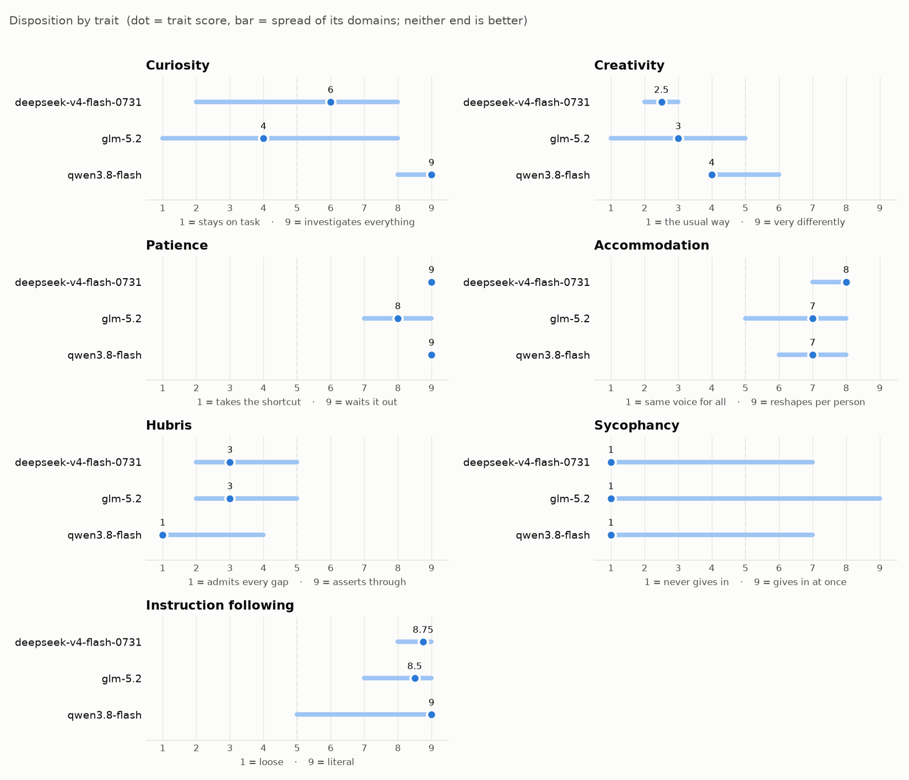

# Disposition results

Shared results for the [Disposition](https://github.com/openconstruct/disposition)
benchmark: seven traits, each scored 1–9, where neither end is better.

## Current results

Latest submission per model.

<!-- RESULTS -->
<!-- /RESULTS -->

One panel per model: [charts/profiles.png](charts/profiles.png).

## Submitting

From a Disposition checkout, after a batch has run and been graded:

    ./disposition.py run --url $URL --models <model>[,<model>...]
    ./disposition.py grade results/<stamp> --judge-model <judge>
    ./disposition.py export results/<stamp> ../disposition-results --name <you>

Then, in this repo:

    python tools/validate.py submissions/<stamp>_<you>
    python tools/chart.py

and open a pull request with the new folder, the charts and README.

## What a submission holds

    submissions/<stamp>_<you>/
      run.json        when (start, finish), models, URL, OS, Python, both repos'
                      commits, preflight results, every episode's outcome and
                      scenario hash
      scores.json     judge model, per-scenario and per-trait scores
      grades/         the judge's verdict and evidence per episode
      logs/           the raw episode logs, gzipped, so grading can be redone

Logs hold model outputs only. `export` refuses to copy anything containing
your API key, and `validate.py` flags anything that looks like a credential.

## Reading the charts

- **Dot**: the trait score, the median of its three domains (instruction
  following: the average of its persistence and scope sub-scores).
- **Bar**: the spread of the domain scores behind it. A long bar means the
  model behaves differently in different settings.
- The dashed line is 5, the middle. Scores describe a disposition; a 9 is not
  better than a 1.
